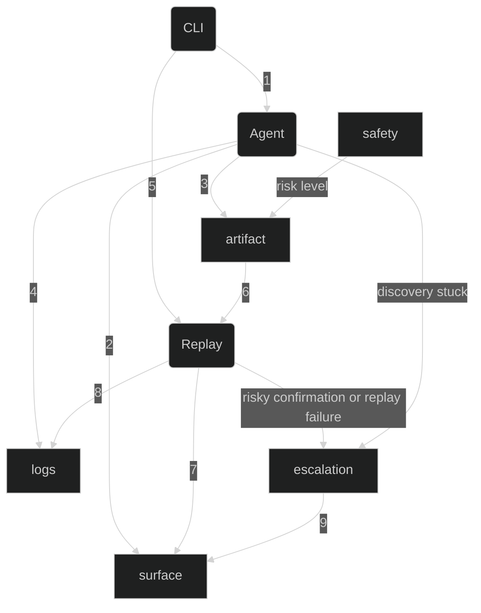

## 1. Architecture
Based on the assignment specification, the system has two distinct flows of the execution: non-deterministic llm `agent` to generate `artifact`, and deterministic `replay` mechanism to use this the same artifact for reproduction. The system is restructured into independent modular components that gets used as shown in diagram below.

**Agent:** takes two parameters 

### Flowchart

## 2. Artifact schema
*the schema and why you shaped it that way.*

## 3. Determinism & error handling
*how you make replay deterministic, and how you detect and handle runtime errors and exceptional states (and, secondarily, any UI drift).*

## 4. Heterogeneity & multi-tenant
*how your design extends to legacy web and desktop surfaces, and to reuse across institutions running the same app (see 3.7).*

## 5. Escalation & handoff
*how you detect "stuck," how a human takes control of the live session, and how control is handed back.*

## 6. Safety
*your guardrail model and its limits.*

## 7. Cuts
*what you deliberately left out, and what you'd build next*