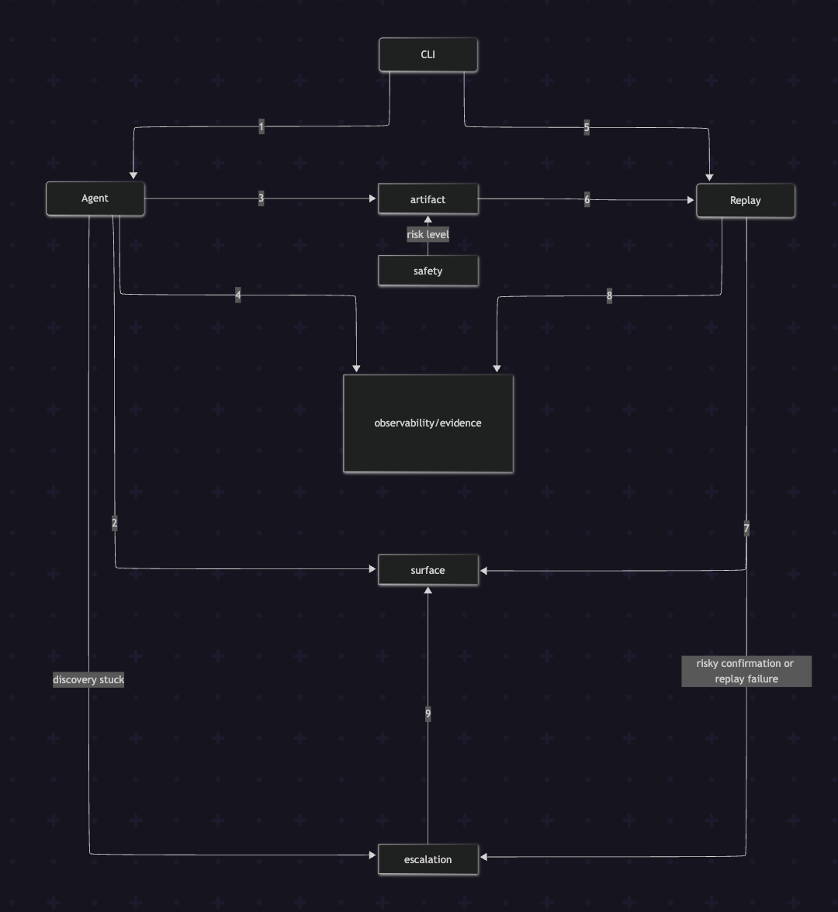

## 1. Architecture
Based on the assignment specification, the system has to have two distinct flows of the execution: non-deterministic llm `agent` to generate `artifact`, and deterministic `replay` mechanism to use this the same artifact for reproduction. The system is restructured into independent modular components that gets used as shown in diagram below.



**Agent:** takes a goal and a starting URL. On each turn it takes a snapshot of the current page, sends that state plus the goal to the model, and asks for one next action from a fixed set: `click`, `type_text`, `navigate`, `read`, `select_option`, or declare the goal done. It executes that one action, records whether it succeeded, and feeds the result back in before asking for the next actio and repeats until:
```
1. the model reports the goal is done
2. the step limit (15) is reached — extendable by 3 more steps if a human resumes from escalation
3. 3 consecutive failed actions occur — also escalates to a human
```

**Replay:** Takes a saved artifact — loaded by capability ID from the `/artifacts/` store — and a set of input values supplied by the caller at invocation time `--input` flag. It walks the artifact's steps in the recorded order, substituting each input into the step that expects it, and executes each step against the same kind of session the agent used. After the last step, it checks whether the artifact's declared condition for success actually holds on the page. 

If it does, replay reports success along with whatever outputs the artifact declares. 
If it doesn't, replay checks whether the page instead matches one of the artifact's declared business outcomes (e.g. a rejection or a not-found result) before concluding it's a real failure. An unrecoverable failure, or a step marked risky without prior confirmation, can also trigger a handoff to a human mid-replay.

**Surface:** is the layer where both Agent and Replay act on — a single wrapper around one browser session that neither of them bypasses, where their interactions on the actions are exectuted through actions methods `read_text`, `click`, `goto`, `select_option`, or `type_text`.

It provides a `snapshot()` for agent that constructs a `pageState`, which consist of the `interactive elements`, `visible text` and a `screenshot` of the page to work on. 

**CLI:** is an orchestrator layer that brings `surface`, `artifacts`, `agent`, and `replay` together.


## 2. Artifact schema
*the schema and why you shaped it that way.*


## 3. Determinism & error handling
*how you make replay deterministic, and how you detect and handle runtime errors and exceptional states (and, secondarily, any UI drift).*


## 4. Heterogeneity & multi-tenant
*how your design extends to legacy web and desktop surfaces, and to reuse across institutions running the same app (see 3.7).*


## 5. Escalation & handoff
*how you detect "stuck," how a human takes control of the live session, and how control is handed back.*


## 6. Safety
*your guardrail model and its limits.*


## 7. Cuts
*what you deliberately left out, and what you'd build next*
